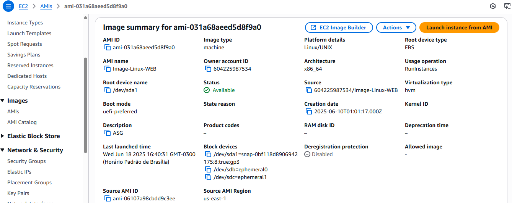
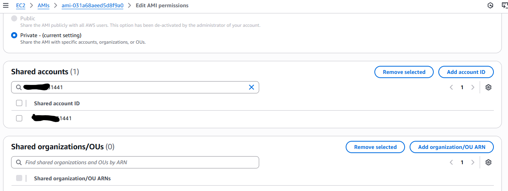
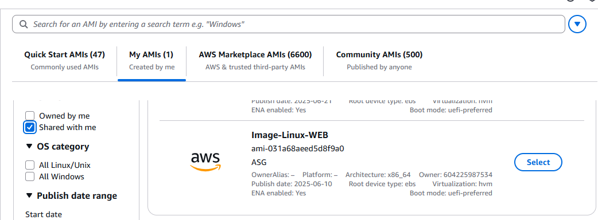
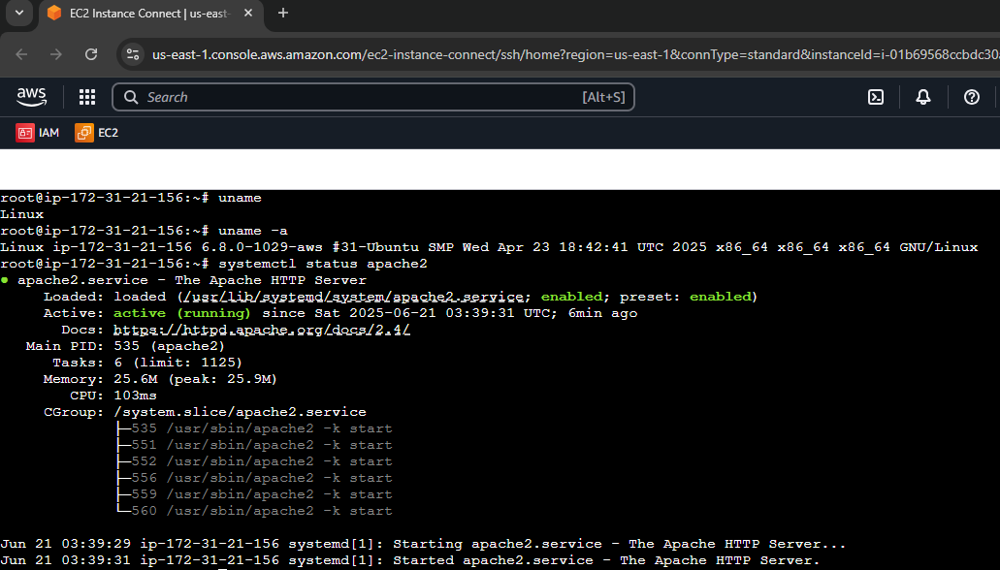

# Criando e Compartilhando AMI Entre Contas AWS

Este laboratório demonstra como criar uma **imagem de máquina Amazon (AMI)** a partir de uma instância EC2 e compartilhá-la com outra conta AWS. Essa prática é essencial para ambientes multi-conta, backup de servidores, padronização de ambientes e estratégias de disaster recovery.

---

## 🎯 Objetivo

- Criar uma AMI personalizada de uma instância EC2 com Apache.
- Compartilhar essa AMI com outra conta AWS.
- Lançar uma nova instância EC2 na segunda conta utilizando a AMI compartilhada.

---

## 🌐 Arquitetura


---

## 🛠️ Tarefas Realizadas

1. **Criar uma Instância EC2 na Conta A:**
   - AMI base: Amazon Linux 2023
   - Tipo: `t2.micro`
   - Configuração opcional via User Data:
     ```bash
     #!/bin/bash
     yum update -y
     yum install -y httpd
     systemctl enable --now httpd
     echo "<h1>Servidor criado para AMI</h1>" > /var/www/html/index.html
     ```

2. **Criar uma AMI da Instância EC2:**
   - Nome: `AMI-Servidor-Web` com Apache
   - Descrição: `AMI criada para compartilhamento entre contas`

3. **Compartilhar a AMI com Outra Conta AWS (Conta B):**
   - Acessar **EC2 > AMIs** na Conta A.
   - Selecionar a AMI e acessar **Actions > Modify Image Permissions**.
   - Selecionar **Private** e adicionar o **Account ID da Conta B**.

4. **Compartilhar o Snapshot (se necessário):**
   - Caso a AMI utilize volumes criptografados com KMS, é necessário:
     - Compartilhar o snapshot associado.
     - Conceder permissão na chave KMS.

5. **Acessar a AMI Compartilhada na Conta B:**
   - Ir para **EC2 > AMIs** na Conta B.
   - Alterar o filtro para **Private Images**.
   - Localizar a AMI compartilhada.

6. **Lançar uma Nova Instância na Conta B Usando a AMI:**
   - Selecionar a AMI compartilhada.
   - Configurar a instância normalmente.
   - Validar se a aplicação (ex.: Apache) está rodando.

---

## ✅ Resultados Esperados

- A Conta B consegue visualizar e utilizar a AMI compartilhada da Conta A.
- A nova instância na Conta B possui exatamente a mesma configuração da instância de origem.
- Processo seguro e sem necessidade de expor dados publicamente.

---

## 📷 Evidências

| Componente                              | Screenshot                                     |
|------------------------------------------|------------------------------------------------|         |
| Criação da AMI com Apache na Conta A                           |             |
| Permissões de AMI (Compartilhamento)     |  |          |
| AMI Visível na Conta B                   |           |
| Instância na Conta B                     |           |

---

## 📘 Recursos Recomendados

- [Documentação AWS – Gerenciar AMIs](https://docs.aws.amazon.com/AWSEC2/latest/UserGuide/AMIs.html)
- [Compartilhamento de AMIs na AWS](https://docs.aws.amazon.com/AWSEC2/latest/UserGuide/sharingamis-explicit.html)
- [Gerenciar Snapshots e Permissões](https://docs.aws.amazon.com/AWSEC2/latest/UserGuide/ebs-modifying-snapshot-permissions.html)

---

