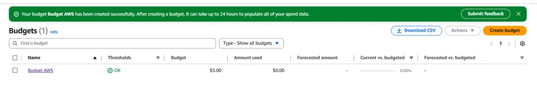

# 💰 LAB AWS – Alertas de Orçamento e Fatura com AWS Budgets
 Este laboratório demonstra como configurar notificações para controlar o uso de recursos e custos na AWS, especialmente útil para ambientes de estudo ou contas com Free Tier.

---

## Objetivo
 Evitar cobranças inesperadas configurando alertas de orçamento e preferências de faturamento.

---

## 🛠️ Serviços Utilizados

- AWS Budgets  
- Billing Preferences  
- CloudWatch (Billing Alerts)  
- SNS (opcional para notificações)

---

## 🔧 Etapas Realizadas

### 1. Configurar Billing Preferences

- ✔️ Ativado o envio de faturas em PDF por e-mail
- ✔️ Habilitada a opção de receber alertas ao exceder o Free Tier
- ✔️ Ativado o envio de métricas de cobrança para o CloudWatch

📸 **Evidência**  

---

### 2. Criar Orçamento com AWS Budgets

- Tipo: **Orçamento Mensal de Custo**
- Limite: **US$ 5,00**
- Alertas configurados em:
  - 75% (US$ 3,75)
  - 85% (US$ 4,25)
  - 95% (US$ 4,75)
- Destinatário: e-mail pessoal (ou tópico SNS)

📸 **Evidência**  
  

---

### 3. Recebendo Notificações por E-mail

- Mensagens automáticas enviadas ao atingir os limites definidos.
- Você pode conectar o orçamento a um **tópico SNS** se quiser automatizar ações.

📸 **Exemplo de E-mail Recebido**  

---

## 🧠 Dica Extra

É possível usar o **CloudWatch + SNS** para criar automações com Lambda, como desligar recursos após certo custo.

---

## 🧾 Resultado Esperado

✔️ Faturas enviadas por e-mail  
✔️ Alertas recebidos com base no uso  
✔️ Prevenção de custos imprevistos no ambiente

---

## 📬 Autor

George Luís  
[LinkedIn](https://www.linkedin.com/in/georgeluist)

---

## 🏷️ Tags

`#AWSBudgets` `#FaturamentoAWS` `#FreeTier` `#CloudWatchBilling` `#LabsAWS`
 
 
 
 
 
 
 
 
 modelo de README

Recentemente, configurei as preferências de faturamento **(Billing Preferences)** e o **AWS Budgets** para receber alertas do uso dos serviços da AWS. Isso é fundamental para evitar surpresas com cobranças indesejadas, principalmente quando utilizamos o nível gratuito.
---
-##🛠Etapas realizadas:

-## Billing Preferences
Invoice delivery preferences ativado para receber as faturas em PDF por e-mail.
Alert preferences habilitado para: Enviar alertas quando o uso se aproxima ou excede os limites do AWS Free Tier. Além disso, enviar alertas de cobrança via Amazon CloudWatch Billing Alerts.
-## AWS Budgets
Criei um orçamento mensal com limite de US$ 5,00, e configurei alertas com thresholds em: 75% (US$ 3,75); 85% (US$ 4,25) e 95% (US$ 4,75).. Esses alertas são enviados por e-mail, permitindo ação rápida antes de exceder o orçamento.

Essa prática é altamente recomendada para qualquer ambiente de estudo ou produção na AWS — especialmente para evitar custos inesperados ao usar o Free Tier!
---
