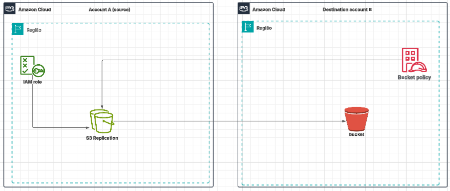
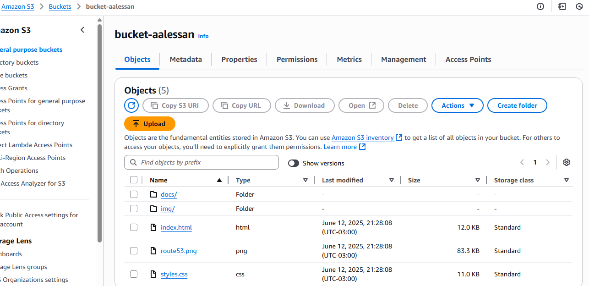
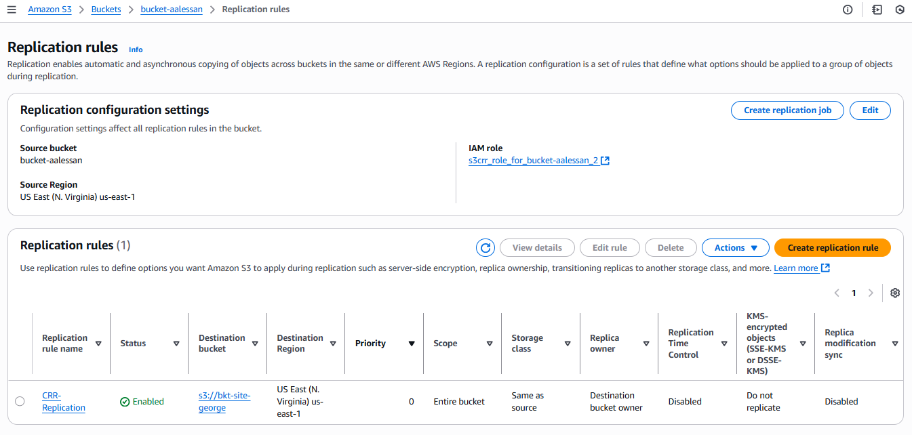
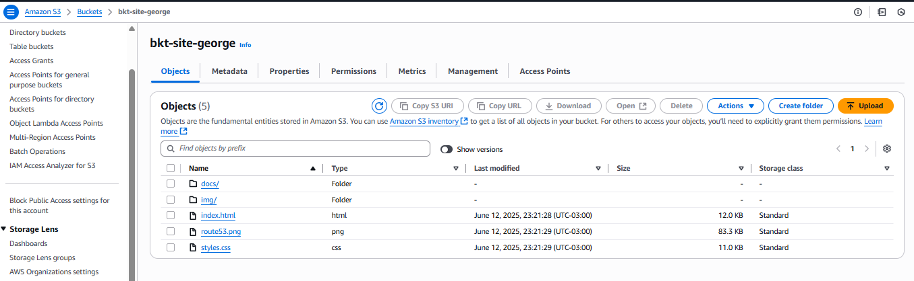

# Amazon S3 Cross-Account Replication

Este repositório demonstra como configurar a replicação de objetos de um bucket S3 em uma conta AWS para outro bucket em uma conta diferente..

---
---
##  Arquitetura

---
---

## Etapas Realizadas

#### Bucket da Conta A (source):
- Criação do bucket com **versionamento ativado**
- Ativação da **replicação automática** para objetos futuros
- Criação de uma **IAM Role com trust policy** específica para permitir acesso à Conta B
- Definição das **Replication Rules**, incluindo filtro de prefixo e destino
- Comando para forçar a replicação de arquivos antigos:  **aws s3 cp s3://bucket-NomeBucketOrigem/ s3://bucket-NomeBucketDestino/ --recursive --metadata-directive REPLACE**

#### Bucket da Conta B (destination):
  - Criação do bucket de destino
  - Aplicação de Bucket Policy permitindo acesso da IAM Role da Conta A
  - Verificação de replicação automática e manual bem-sucedida.

---
---

## 📷 Evidências

| Componente                      | Screenshot                         |
|---------------------------------|-------------------------------------|
| Bucket da **Conta A** |           |
| Replication rules Bucket da **Conta A** | |
| Bucket da **Conta B** (inicialmente vazio)|    |        
| Bucket policy da **Conta B** |   |
| Execução do comando de replicação manual	 |   |
| Evidencia que os arquivos foram replicados para o Bucket da **Conta B** |           |
---

