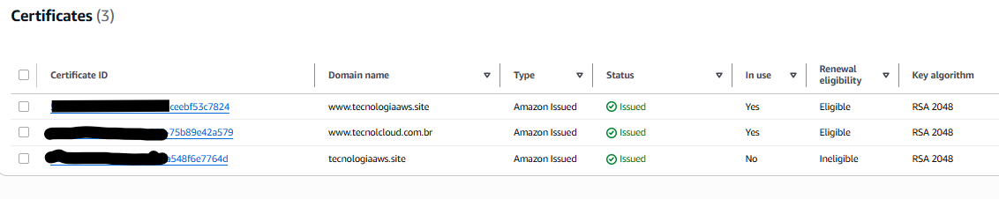
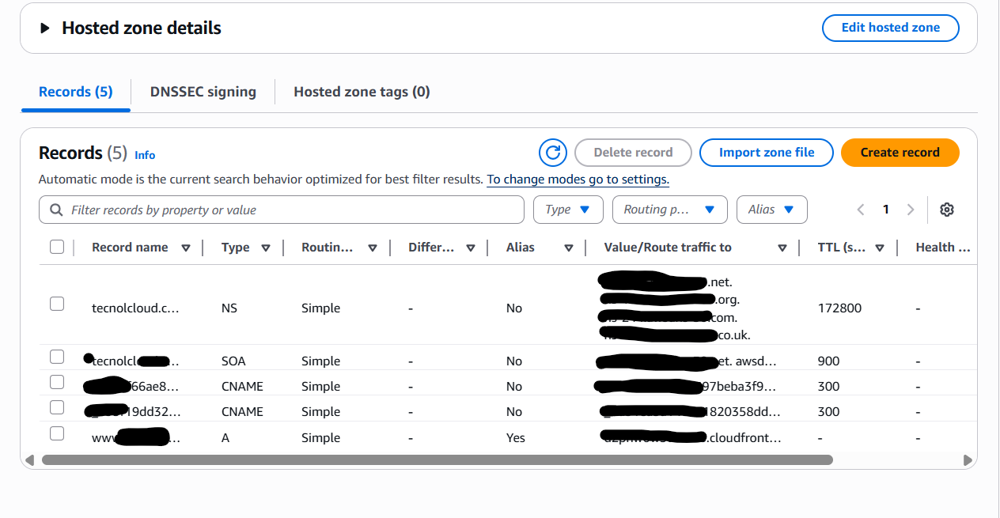

# Hospedagem de Site Estático na AWS com S3 + CloudFront + Route 53 + ACM

Este repositório demonstra como configurar a hospedagem de um site estático na AWS utilizando **Amazon S3** para armazenamento, **CloudFront** como CDN com SSL, **Route 53** para gerenciamento de DNS e **AWS Certificate Manager (ACM)** para emissão do certificado SSL/TLS.

---
---
## 🏗️ Arquitetura


---
---
## Etapas Realizadas

### Bucket S3 (Hospedagem de Arquivos Estáticos)
- Criação do bucket com o nome do domínio (ex.: `meusite.com.br`)
- Habilitação da opção de **site estático**
- Upload dos arquivos `index.html` e `error.html`
- Criação da **bucket policy pública**, permitindo acesso somente de leitura via HTTP (posteriormente restrito via CloudFront)

---
### AWS Certificate Manager (ACM)
- Criação de um **certificado SSL/TLS**
- Validação via **registro DNS no Route 53**
- Certificado emitido e pronto para ser utilizado no **CloudFront**

---
### CloudFront (CDN com HTTPS)
- Criação da distribuição CloudFront
- Configuração para:
  - Origem: Bucket S3
  - Redirecionamento HTTP → HTTPS
  - SSL/TLS via certificado ACM
  - Política de cache padrão
- Definição do **domínio customizado (CNAME)** para apontar o site (ex.: `meusite.com.br`)

---
### Route 53 (Gerenciamento de DNS)
- Criação do registro tipo **A com Alias** apontando para a distribuição CloudFront
- Gerenciamento do domínio e propagação dos registros DNS

---
---
## 📷 Evidências

| Componente                                              | Screenshot                                     |
|---------------------------------------------------------|-------------------------------------------------|
| Bucket S3 configurado como site estático                |                        |
| Bucket Policy aplicada para acesso público inicial      |                |
| Certificado emitido no ACM                              |                      |
| Validação DNS do ACM via Route 53                       | |
| Distribuição CloudFront criada e configurada            |        |
| Registro DNS no Route 53 apontando para CloudFront      |                      |
| Site acessível via HTTPS com domínio customizado        |                    |

---
---
## ⚙️ Comandos Terraform Utilizados

```bash
# Inicializar o ambiente Terraform
terraform init

# Planejar as mudanças
terraform plan

# Aplicar a infraestrutura
terraform apply

# Destruir toda a infraestrutura provisionada
terraform destroy
