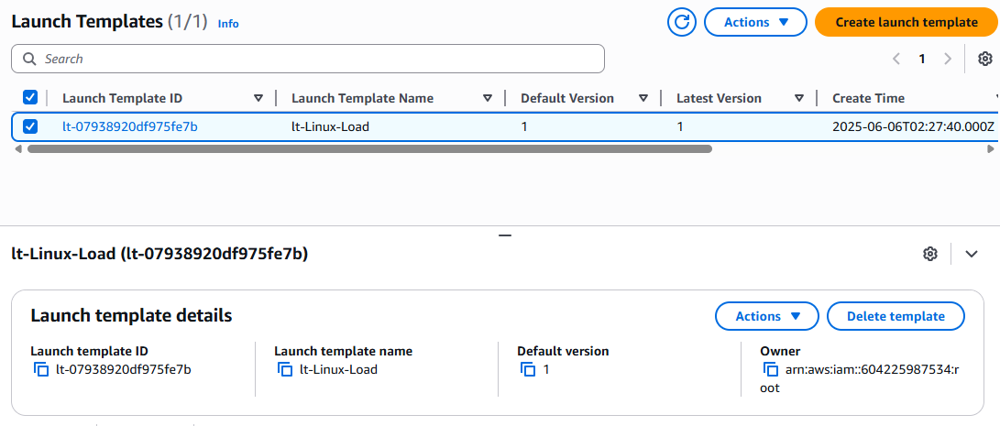
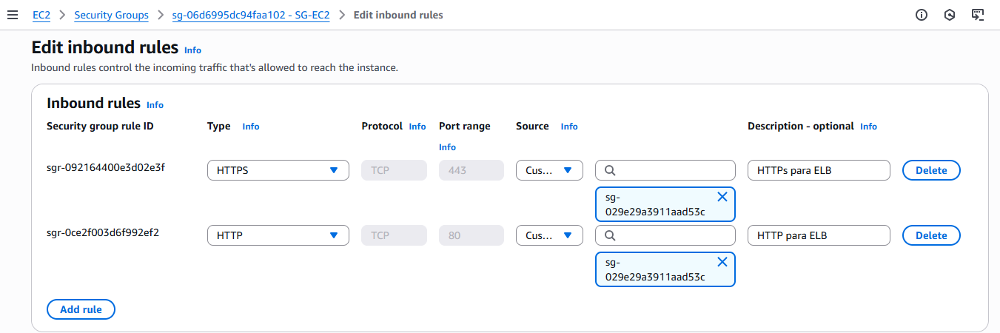
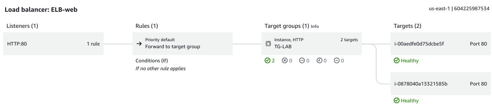

# 🧪 Laboratório AWS: Load Balancer com Auto Scaling Group (ASG)

Este laboratório demonstra a criação de uma infraestrutura escalável e tolerante a falhas usando serviços da AWS: EC2, AMI, Launch Template, Auto Scaling Group, Target Group e Load Balancer.

---
## 🔧 Etapas Realizadas

1. **Criação de uma AMI personalizada** com Apache instalado via script `user_data.sh`.
2. **Launch Template** criado com base na AMI.
3. **Security Groups**: SG do Load Balancer: permite HTTP/HTTPS de `0.0.0.0/0` e SG das EC2: permite HTTP/HTTPS **apenas do SG do Load Balancer**
4. **Application Load Balancer (ALB)** criado e integrado ao Target Group. 

5. **Application Load Balancer (ALB)** criado e integrado ao Target Group.
6. **Auto Scaling Group** configurado com políticas de escala mínima, máxima e desejada.
7. **Target Group** para registrar as instâncias EC2 automaticamente.
8. 
9. Testes e validações de balanceamento de carga e escalabilidade.

## 📷 Evidências

| Componente | Screenshot |
|-----------|------------|
| 1. **Criação de uma AMI personalizada**|  |
| 2. **Launch Templates**  |  |
| 3. **Security Groups**  |  |
| 4. **Application Load Balancer (ALB)**  |  |

## 🧠 Arquitetura

