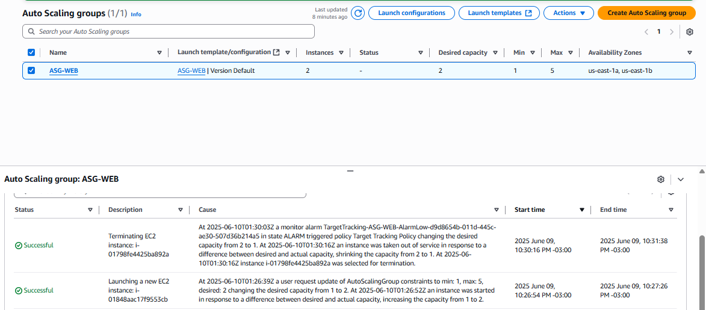

# Laboratório AWS: Load Balancer com Auto Scaling Group (ASG)

Este laboratório demonstra a criação de uma infraestrutura escalável e tolerante a falhas usando os principais serviços da AWS: **EC2, AMI, Launch Template, Target Group, Auto Scaling Group (ASG)** e **Application Load Balancer (ALB)**.

---

## 🔧 Etapas Realizadas

- **Launch Template** criado com base em uma AMI personalizada com Apache.
- **Security Groups**:
  - Load Balancer: permite HTTP/HTTPS de `0.0.0.0/0`.
  - EC2: permite HTTP/HTTPS apenas do SG do Load Balancer.
- **Application Load Balancer (ALB)** criado e integrado ao Target Group.
- **Target Group** configurado com health check e registro automático das instâncias.
- **Auto Scaling Group (ASG)** com:
  - Capacidade: mínima `1`, desejada `1`, máxima `4`.
  - Escalonamento baseado em **CPU > 50%**.
- **Testes de balanceamento**:
  - Requisições alternam entre instâncias EC2 com respostas distintas via ALB.

---

## 🔁 Configuração do Auto Scaling Group

- **Nome**: `ASG-LAB`
- **Launch Template**: `Launch-LAB` (`lt-07f2c52e4ffdded04`) – versão default (v1)
- **VPC**: `vpc-009eb8b33026995d1`
- **Subnets**:
  - `us-east-1a`: `subnet-06ad386c140a7724f`
  - `us-east-1b`: `subnet-0318f09dca67eb6d3`
- **Distribuição entre AZs**: Balanced
- **Tipo de instância**: herdado do Launch Template
- **Load Balancer**: `ELB-web` (Application/HTTP)
- **Target Group**: `TG-LAB`
- **Health Checks**: EC2 + ELB, com `grace period` de 60 segundos
- **Scaling Policy**: Target tracking (CPU utilization 50%), cooldown 60s
- **Monitoramento**: habilitado
- **Notificações SNS**: `Noticante-Padrao` com eventos de lançamento e término
- **Tag automática nas instâncias**: `Name = LAB ASG`

---

## 📷 Evidências

| Componente                               | Screenshot                |
|------------------------------------------|----------------------------|
| 1. Launch Template                       |  |
| 2. Security Groups                       |   |
| 3. Application Load Balancer (ALB)       | |
| 4. Target Group                          |   |
| 5. Auto Scaling Group                       |   |
| 5. Validação do Balanceamento 1          | |
| 6. Validação do Balanceamento 2          | |

---

## 🧠 Arquitetura

