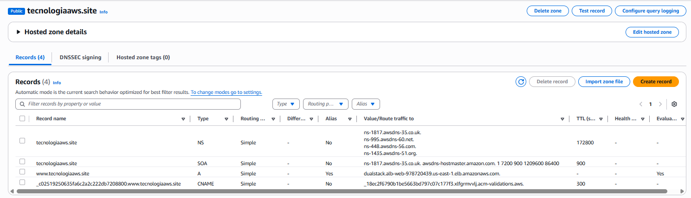
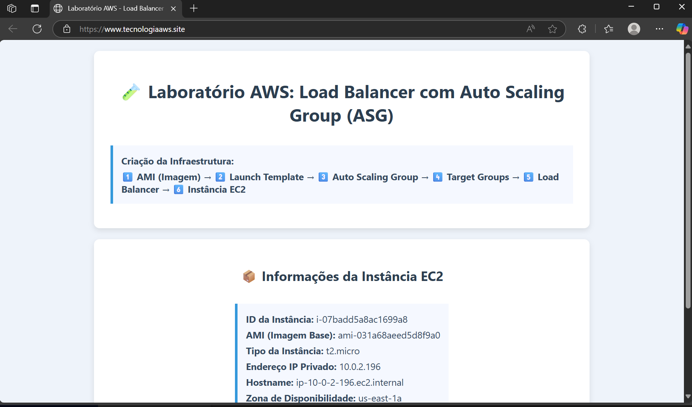
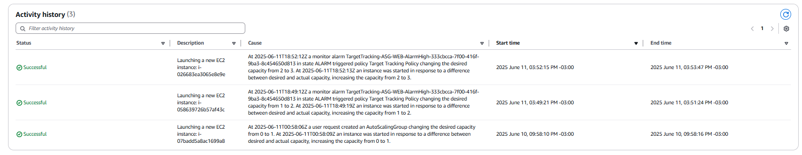
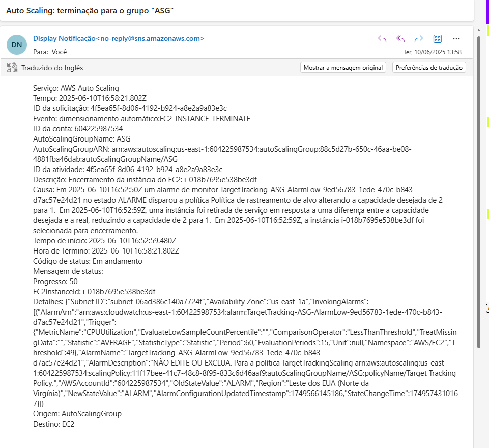

# Laboratório AWS: Load Balancer + Auto Scaling + Route 53 + SSL com ACM

Este laboratório demonstra a criação de uma infraestrutura escalável e tolerante a falhas usando os principais serviços da AWS: **VPC, EC2, AMI, Launch Template, Target Group, Auto Scaling Group (ASG)** e **Application Load Balancer (ALB)** com domínio e SSL.

---
---

##  Arquitetura

---

---

## 📋 Etapas Realizadas

### 🔹 VPC
- Criadas 2 subnets públicas e 2 subnets privadas em diferentes zonas de disponibilidade (AZs).
- Internet Gateway (IGW) associado à VPC.
- NAT Gateway para dar acesso externo às instâncias privadas.
- Acesso SSH restrito ao meu IP.

### 🔹 Route 53
- Configurado domínio customizado `www.tecnologiaaws.site` apontando para o Load Balancer (ALIAS record).
  
### 🔹 AWS Certificate Manager (ACM)
- Certificado público emitido gratuitamente com validação DNS.
- Integrado ao ALB para suporte HTTPS (TLS).

### 🔹 Launch Template
- Criado com base em uma AMI personalizada com Apache instalado e configurado.

### 🔹 Security Groups
- **ALB**: permite HTTP/HTTPS (`0.0.0.0/0`).
- **Instâncias EC2 (ASG)**: só recebem tráfego do SG do ALB.

### 🔹 Application Load Balancer (ALB)
- Deploy em subnets públicas.
- Listener HTTP e HTTPS.
- Redirecionamento automático de HTTP → HTTPS.
- Integrado com Target Group.

### 🔹 Target Group
- Health checks via HTTP no path `/`.
- Instâncias registradas automaticamente pelo ASG.

### 🔹 Auto Scaling Group (ASG)
- Rodando nas subnets privadas.
- Capacidade mínima: `1`, desejada: `1`, máxima: `4`.
- Políticas baseadas em CPU > 70%.
- Notificações via SNS (e-mail e SMS).

---

## Testes de balanceamento

- Apache com variação em instâncias para validação visual.
- Uso da ferramenta `stress` para forçar scaling.
- Acesso ao domínio e análise de comportamento do ALB.

---
## 📷 Evidências

| Componente                      | Screenshot                         |
|---------------------------------|-------------------------------------|
| VPC                             |           |
| Route 53                        | |
| AWS Certificate Manager (ACM)   |           |
| Launch Template                 |       |
| Target Group                    |           |
| ALB com Listeners and rules           |          |
| Validação o https://www.tecnologiaaws.site/     | |
| Validação do Balanceamento     | |
| Validação do Balanceamento - Activity history     | |
| Notificações (SNS)             |          |

---
