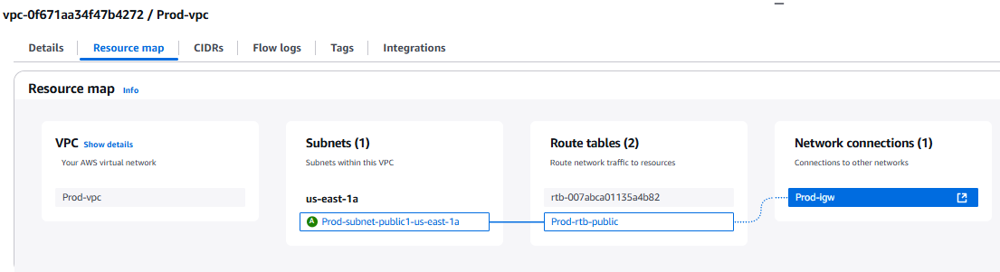
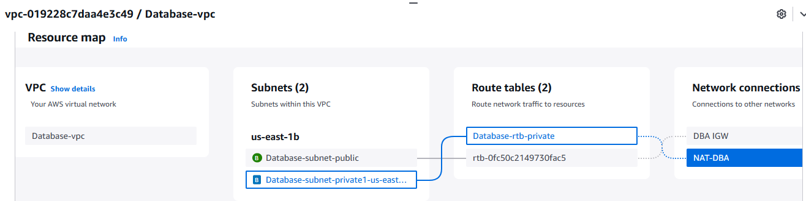
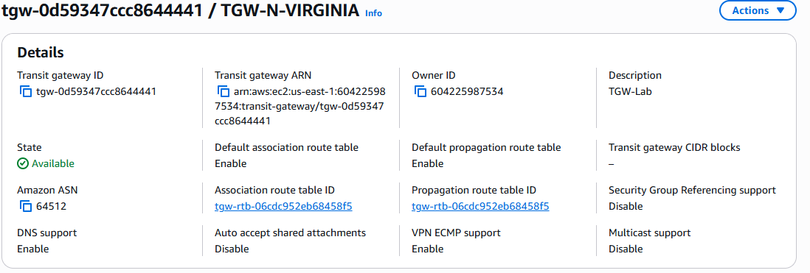
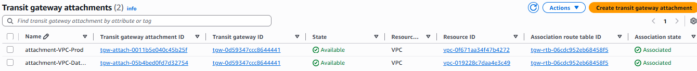
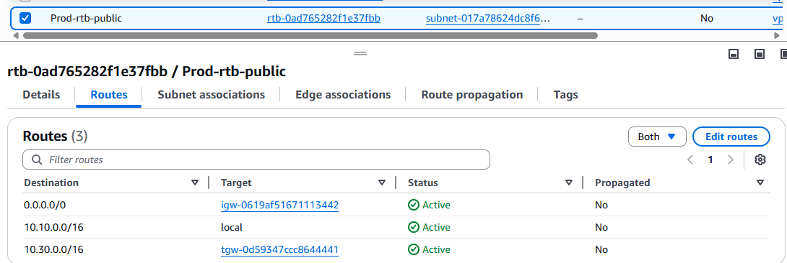
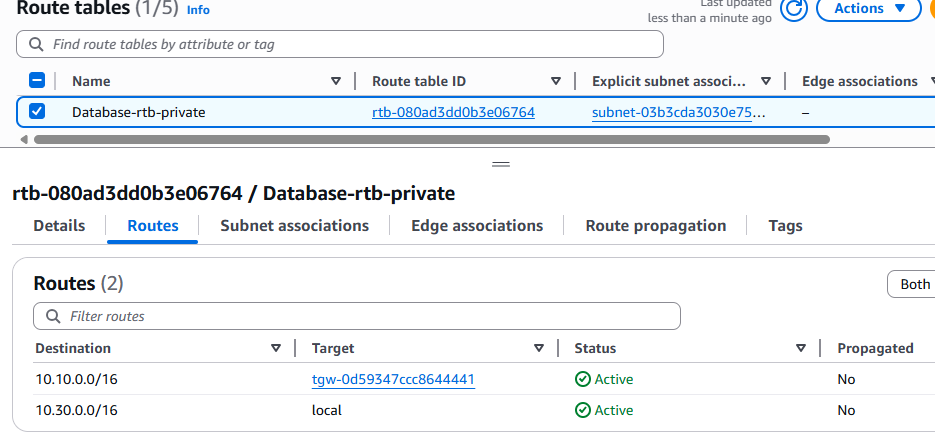
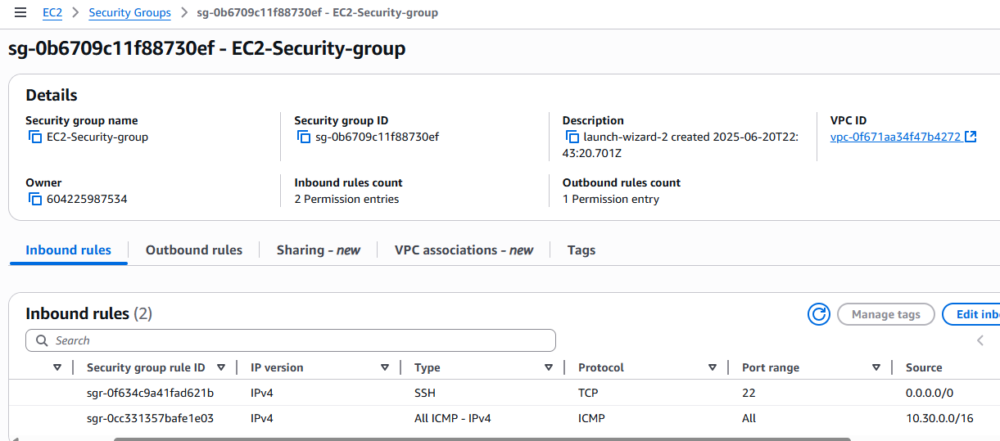
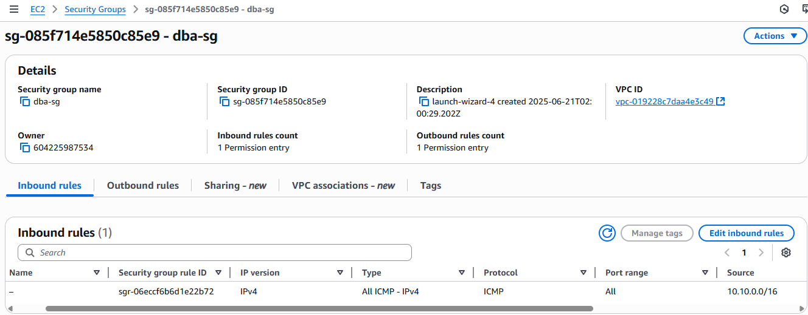
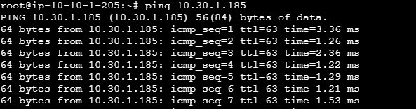
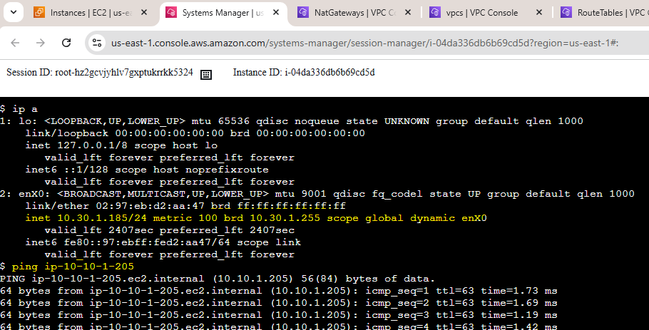

# 🛰️ Comunicação entre VPCs com AWS Transit Gateway

Este laboratório demonstra como estabelecer comunicação privada e escalável entre duas VPCs distintas na AWS, utilizando o **AWS Transit Gateway (TGW)**. Essa abordagem é ideal para ambientes multi-VPC ou multi-conta que precisam de interconexão centralizada e segura.

---

## 🎯 Objetivo

Habilitar comunicação privada entre instâncias EC2 localizadas em diferentes VPCs (VPC-Prod e VPC-Database), por meio de um Transit Gateway, promovendo boas práticas de escalabilidade, segurança e gerenciamento de redes.

---

## 🌐 Arquitetura

---

## 🛠️ Tarefas Realizadas

1. **Criar duas VPCs:**
   - `VPC-Prod` → CIDR: `10.10.0.0/16`
   - `VPC-Database` → CIDR: `10.30.0.0/16`

2. **Criar Subnets:**
   - Subnet pública `10.10.1.0/24` em `VPC-Prod` (AZ: `us-east-1a`)
   - Subnet privada `10.30.1.0/24` em `VPC-Database` (AZ: `us-east-1b`)

3. **Criar Instâncias EC2:**
   - `EC2-Prod` em VPC-Prod
   - `EC2-DB` em VPC-Database

4. **Criar Transit Gateway:**
   - Nome: `TGW-NVIRGINIA`
   - Habilitar DNS Support e Default Route Propagation

5. **Criar Transit Gateway Attachments:**
   - Anexar `VPC-Prod` ao TGW
   - Anexar `VPC-Database` ao TGW

6. **Editar Route Tables:**
   - Em `VPC-Prod`, adicionar rota para `10.30.0.0/16` via TGW
   - Em `VPC-Database`, adicionar rota para `10.10.0.0/16` via TGW

7. **Configurar Security Groups:**
   - Liberar ICMP (ping) e/ou SSH entre as instâncias

8. **Testes de Conectividade:**
   - SSH e ping de `EC2-Prod` para `EC2-DB` via IP privado
   - Teste inverso: `EC2-DB` para `EC2-Prod`

---

## ✅ Resultados Esperados

- Comunicação entre EC2s via IP privado
- Tráfego roteado por meio do Transit Gateway
- Nenhum tráfego exposto à internet
- Conectividade segura e escalável

---

## 📷 Evidências

| Componente                         | Screenshot                                  |
|-----------------------------------|----------------------------------------------|
| `VPC-Prod` → CIDR: `10.10.0.0/16` |          |
| `VPC-Database` → CIDR: `10.30.0.0/16` |           |
| Transit Gateway                   |                   |
| TGW Attachments                   |   |
| Route Table - VPC-Prod            |            |
| Route Table - VPC-Database        |                |
| Security Group - EC2-Prod         |            |
| Security Group - EC2-DB           |                |
| Ping EC2-Prod → EC2-DB            |        |
| Ping EC2-DB → EC2-Prod            |        |

---

## 📘 Recursos Recomendados

- [AWS Transit Gateway Documentation](https://docs.aws.amazon.com/vpc/latest/tgw/what-is-transit-gateway.html)
- [Melhores práticas de VPC Networking](https://docs.aws.amazon.com/vpc/latest/userguide/VPC_Scenarios.html)

---

## 🧠 Observações

Este laboratório pode ser expandido para cenários com múltiplas VPCs, VPCs em contas diferentes, ou com integração com Direct Connect e VPNs on-premises.

---

