# 🛰️ Comunicação entre VPCs usando VPC Peering Inter-Region e AWS Transit Gateway Multi-Account

Este laboratório demonstra como estabelecer comunicação privada, escalável e segura entre três VPCs, sendo duas na mesma conta, porém em **regiões diferentes**, e uma em **outra conta na mesma região da primeira VPC**, utilizando uma combinação de **VPC Peering Inter-Region** e **AWS Transit Gateway (TGW)**.  

Essa abordagem é ideal para ambientes multi-região e multi-conta que precisam de interconexão centralizada, resiliente e segura.

---

## 🎯 Objetivo

Habilitar comunicação privada entre instâncias EC2 localizadas em três VPCs diferentes, distribuídas em duas regiões e duas contas AWS, utilizando:  
- **VPC Peering** entre VPCs na mesma conta, porém em regiões diferentes.  
- **Transit Gateway (TGW)** para interconexão entre contas e para roteamento centralizado.

---

## 🌐 Arquitetura

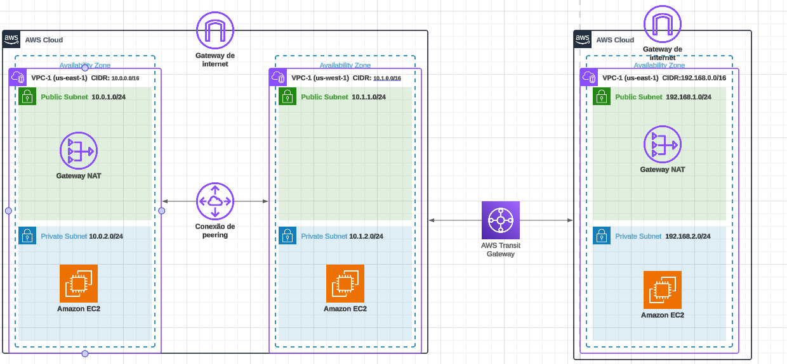

---

## 🛠️ Tarefas Realizadas

### 🔸 Na Conta A (`Conta-Network`) – Região `us-east-1` (N. Virginia)
1. **VPC-1** (us-east-1)
   - CIDR: 10.0.0.0/16
   - Subnets: públicas/privadas (10.0.1.0/24, 10.0.2.0/24)
2. **VPC-2** (us-west-1)
 - CIDR: 10.1.0.0/16
 - Subnets: públicas/privadas (10.1.1.0/24, 10.1.2.0/24)

1. **Criar VPC:**
   - `VPC-East` → CIDR: `10.0.0.0/16`

2. **Criar Subnet:**
   - Subnet pública `10.0.1.0/24` (AZ: `us-east-1a`)

3. **Criar Instância EC2:**
   - `EC2-East` na VPC-East

4. **Criar Transit Gateway:**
   - Nome: `TGW-East`
   - Habilitar DNS Support e Default Route Table Association/Propagation conforme necessidade

5. **Criar Transit Gateway Attachment (VPC):**
   - Anexar `VPC-East` ao TGW-East

---

### 🔹 Na Conta A (`Conta-Network`) – Região `us-west-1` (Califórnia)

1. **Criar VPC:**
   - `VPC-West` → CIDR: `10.1.0.0/16`

2. **Criar Subnet:**
   - Subnet pública `10.1.1.0/24` (AZ: `us-west-1a`)

3. **Criar Instância EC2:**
   - `EC2-West` na VPC-West

4. **Criar VPC Peering:**
   - Entre `VPC-East` (us-east-1) e `VPC-West` (us-west-1)
   - Aceitar a solicitação de peering na região `us-west-1`

5. **Configurar Rotas:**
   - Na VPC-East, rota para `10.1.0.0/16` via Peering
   - Na VPC-West, rota para `10.0.0.0/16` via Peering

---

### 🔸 Na Conta B (`Conta-App`) – Região `us-east-1` (N. Virginia)

1. **Criar VPC:**
   - `VPC-App` → CIDR: `192.168.0.0/16`

2. **Criar Subnet:**
   - Subnet pública `192.168.1.0/24` (AZ: `us-east-1a`)

3. **Criar Instância EC2:**
   - `EC2-App` na VPC-App

4. **Compartilhar o Transit Gateway (`TGW-East`) da Conta-Network:**
   - Usar o **Resource Access Manager (RAM)** para compartilhar o TGW com a Conta-App

5. **Criar Transit Gateway Attachment (VPC):**
   - Anexar `VPC-App` ao `TGW-East`

---

### 🔗 Configuração de Rotas

1. **Route Table do TGW-East:**
   - Rota para `192.168.0.0/16` → Attachment da VPC-App
   - Rota para `10.0.0.0/16` → Attachment da VPC-East

2. **Route Table da VPC-East (us-east-1):**
   - Rota para `192.168.0.0/16` → Transit Gateway (TGW-East)
   - Rota para `10.1.0.0/16` → VPC Peering (VPC-West)

3. **Route Table da VPC-App (us-east-1):**
   - Rota para `10.0.0.0/16` → Transit Gateway (TGW-East)
   - Rota para `10.1.0.0/16` → Transit Gateway → VPC-East → Peering → VPC-West

4. **Route Table da VPC-West (us-west-1):**
   - Rota para `10.0.0.0/16` → VPC Peering (VPC-East)
   - Rota para `192.168.0.0/16` → VPC Peering → VPC-East → TGW → VPC-App

---

### 🔐 Configuração dos Security Groups

- Permitir **ICMP (ping)** e/ou **SSH (porta 22)**:
  - Entre `10.0.0.0/16`, `10.1.0.0/16` e `192.168.0.0/16` mutuamente.

---

### 🔧 Testes de Conectividade

- **Ping ou SSH de:**
  - `EC2-East` ↔ `EC2-West` (via Peering Inter-Region)
  - `EC2-East` ↔ `EC2-App` (via Transit Gateway)
  - `EC2-West` ↔ `EC2-App` (via VPC-East como trânsito)

---

## ✅ Resultados Esperados

- Comunicação bem-sucedida via IP privado entre todas as instâncias.
- Tráfego roteado corretamente:
  - Direto via Peering para VPCs na mesma conta (regiões diferentes).
  - Via Transit Gateway para comunicação entre contas.
- Nenhum tráfego exposto à internet.
- Arquitetura escalável, multi-conta e multi-região.

---

## 📷 Evidências

| Componente                          | Screenshot                                      |
|--------------------------------------|-------------------------------------------------|
| `VPC-East` → CIDR: `10.0.0.0/16`     | 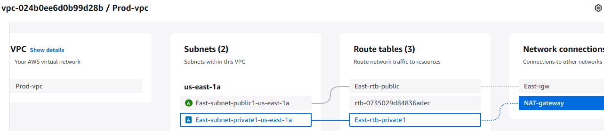            |
| `VPC-West` → CIDR: `10.1.0.0/16`     | 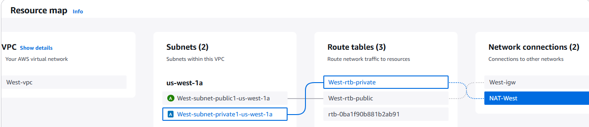            |
| `VPC-App` → CIDR: `192.168.0.0/16`   | 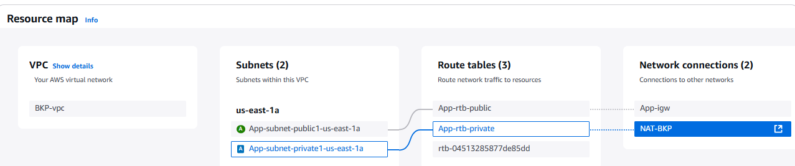              |
| Transit Gateway (TGW-East)           | 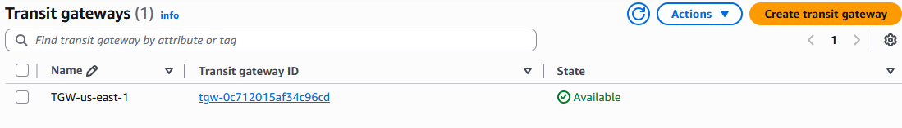                 |
| VPC Peering (East ↔ West)            | 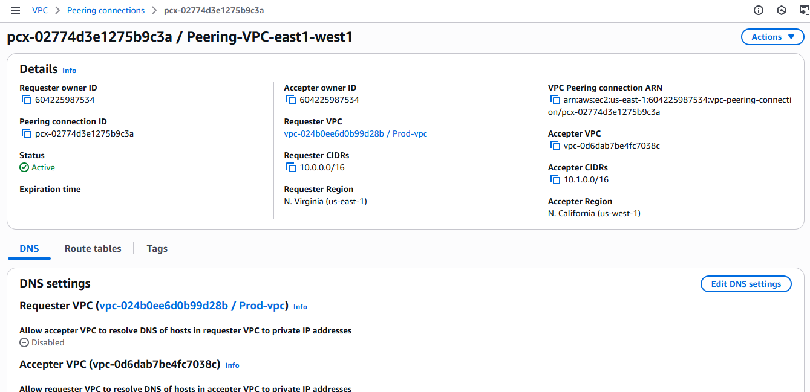          |
| Route Table - VPC-East               | 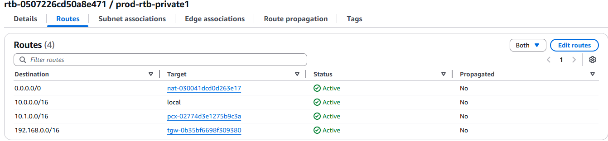              |
| Route Table - VPC-West               | 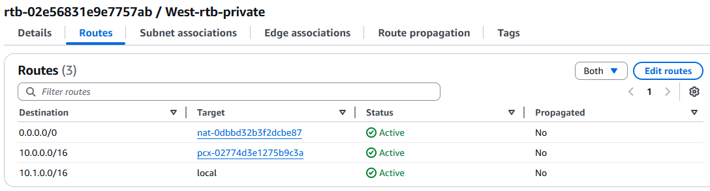              |
| Route Table - VPC-App                | 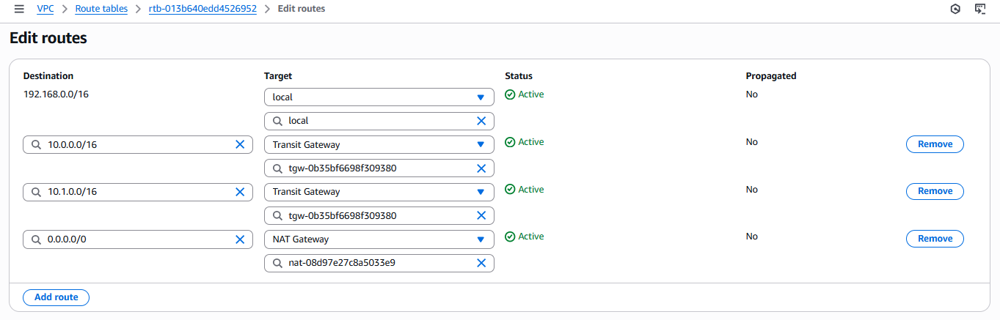                |
| Security Group - EC2-East            | 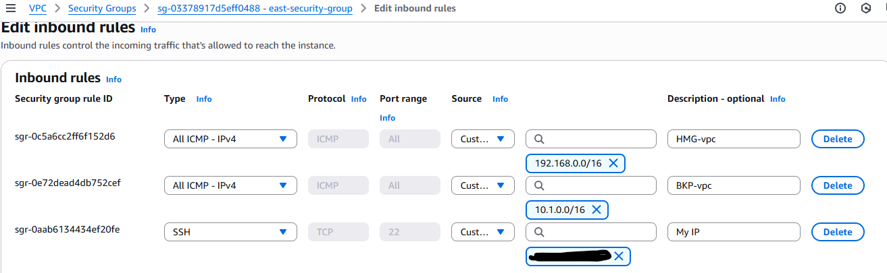              |
| Security Group - EC2-West            | 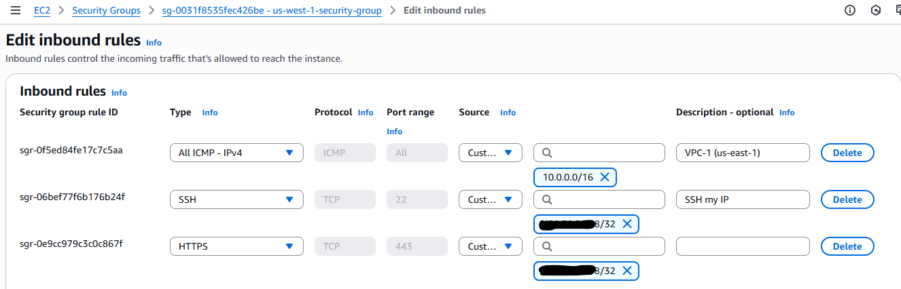              |
| Security Group - EC2-App             | 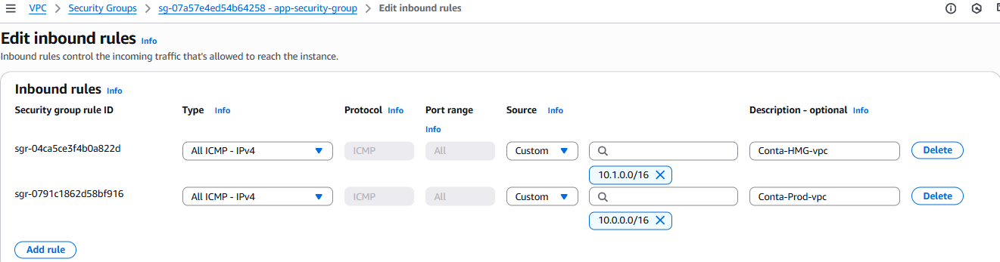                |
| Ping EC2-East → EC2-App              | 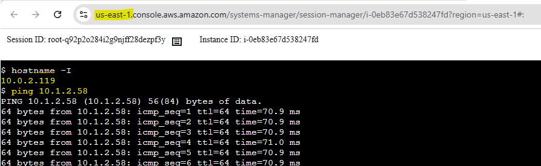         |
| Ping EC2-West → EC2-App              | 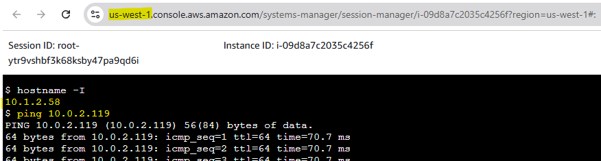         |
| Ping EC2-East → EC2-West             | 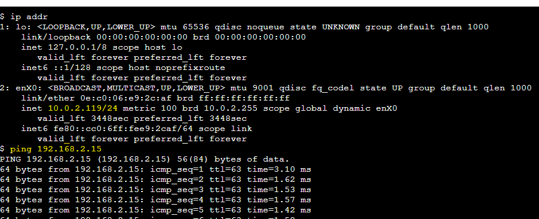        |

---

