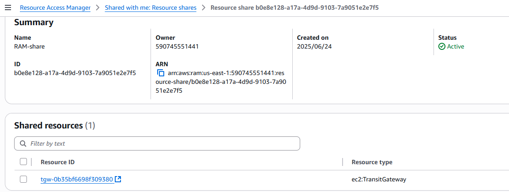
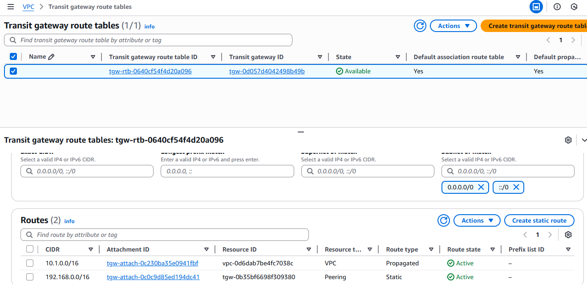
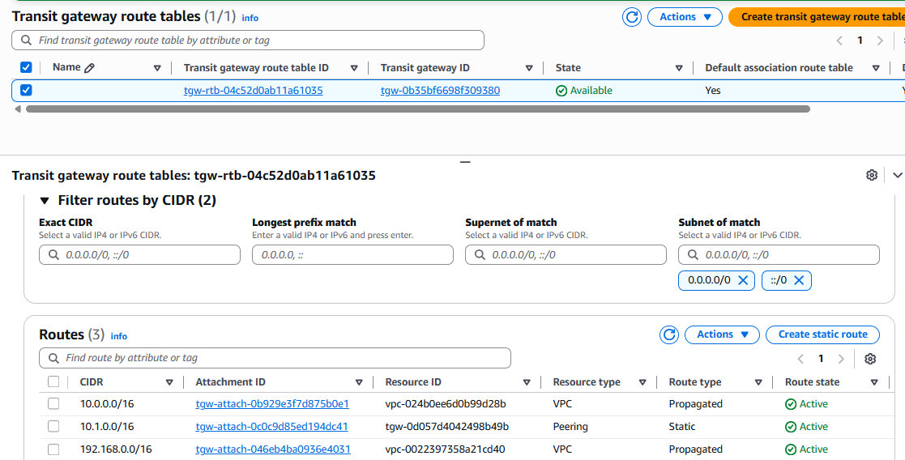
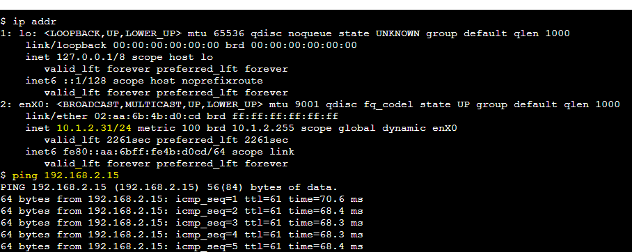
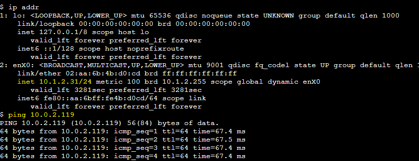
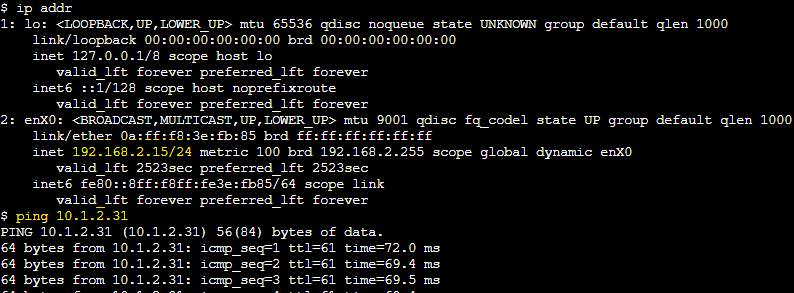
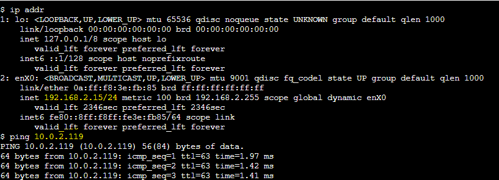

# Comunicação entre VPCs usando VPC Peering Inter-Region e AWS Transit Gateway Multi-Account

Este laboratório demonstra como estabelecer comunicação privada, escalável e segura entre três VPCs, sendo duas na mesma conta (em regiões diferentes) e uma em outra conta (na mesma região da primeira VPC), utilizando uma combinação de **VPC Peering Inter-Region** e **AWS Transit Gateway (TGW)** com **Resource Access Manager (RAM)**.

Essa abordagem é ideal para ambientes multi-região e multi-conta que precisam de uma interconexão centralizada, resiliente e segura.

---

## 🎯 Objetivo

Habilitar comunicação privada entre instâncias EC2 localizadas em três VPCs diferentes, distribuídas em duas regiões e duas contas AWS, utilizando:  
- **VPC Peering** entre VPCs na mesma conta, porém em regiões diferentes.  
- **Transit Gateway (TGW)** para interconexão entre contas e roteamento centralizado.

---

## Arquitetura

---
## Tarefas Realizadas

### Conta A (Conta-Network) — `us-east-1` e `us-west-1`
- Criadas duas VPCs: `Prod-vpc` (us-east-1) e `HMG-vpc` (us-west-1), com CIDRs distintos.
- Estabelecido **VPC Peering Inter-Region** entre `Prod-vpc` (us-east-1) e `HMG-vpc` (us-west-1).
- Configuradas rotas nas tabelas de ambas as VPCs para permitir comunicação via Peering.

### Conta B (Conta-App) — `us-east-1`
- Criada a `BKP-vpc` com subnets públicas e privadas.
- **Transit Gateway (TGW-East)** criado na Conta A e compartilhado com a Conta B via **AWS Resource Access Manager (RAM)**.
- **Transit Gateway Attachment** adicionado à `BKP-vpc`.

### Configuração de Rotas
- **Route Table do TGW-East**: Configuração de rotas para a `VPC-App` e `VPC-East`.
- **Route Tables nas VPCs**: Rotas configuradas para comunicação via Peering e TGW.

### Security Groups
- Configuração de **Security Groups** para permitir tráfego entre os CIDRs das VPCs.
- Abertura de **ICMP** para testes de conectividade e **SSH (Porta 22)** opcional para acesso remoto.

### Testes Realizados
- **Ping** e/ou **SSH** entre instâncias EC2 nas VPCs `Prod-vpc`, `HMG-vpc` e `BKP-vpc`, validando a conectividade via Peering e Transit Gateway.

## Resultados Esperados
- **Comunicação privada** bem-sucedida entre todas as instâncias EC2.
- **Tráfego roteado corretamente**:
  - Direto via Peering entre `VPC-East ↔ VPC-West`.
  - Via TGW para comunicação entre `VPC-East ↔ VPC-App` e `VPC-West ↔ VPC-App`.
- Nenhum tráfego passa pela **internet pública**.
- Arquitetura **escalável**, **multi-conta** e **multi-região**.

---
---

## ✅ Resultados Esperados

- Comunicação privada bem-sucedida entre todas as instâncias EC2.
- Tráfego roteado corretamente:
   - **Direto via Peering** entre `VPC-East ↔ VPC-West`.
   - **Via TGW** para comunicação entre `VPC-East ↔ VPC-App` e `VPC-West ↔ VPC-App`.
- Nenhum tráfego passa pela internet pública.
- Arquitetura escalável, multi-conta e multi-região.

---

## 📷 Evidências

| Componente                              | Screenshot                                      |
|------------------------------------------|-------------------------------------------------|
| **Conta A:** Prod-vpc → `10.0.0.0/16`    |             |
| **Conta A:** HMG-vpc → `10.1.0.0/16`    |             |
| **Conta B:** BKP-vpc → `192.168.0.0/16`  |               |
| **Resource Access Manager**           |     
| **TGW policy tables HMG-vpc**           |                  |
| **TGW policy tables BKP-vpc**           |     
| **VPC Peering (Prod-vpc ↔ HMG-vpc)**            |           |
| **Route Table - Prod-vpc**               |               |
| **Route Table - HMG-vpc**               |               |
| **Route Table - BKP-vpc**                |                 |
| **Security Group - EC2-East**            |               |
| **Security Group - EC2-West**            |               |
| **Security Group - EC2-App**             |                 |
|  Conta A **Prod-vpc** Ping EC2-East → Conta B **BKP-vpc** EC2-App  | |
| Conta A **Prod-vpc** Ping EC2-East → Conta A **HMG-vpc** EC2-West            |   | 
|  Conta A **HMG-vpc** Ping EC2-East → Conta B **BKP-vpc** EC2-App  | |
| Conta A **HMG-vpc** Ping EC2-East → Conta A **Prod-vpc** EC2-West            |   | 
| Conta B **BKP-vpc** Ping EC2-East → Conta A **HMG-vpc** EC2-West            |   | 
| Conta B **BKP-vpc** Ping EC2-East → Conta A **Prod-vpc** EC2-West            |   | 

---
